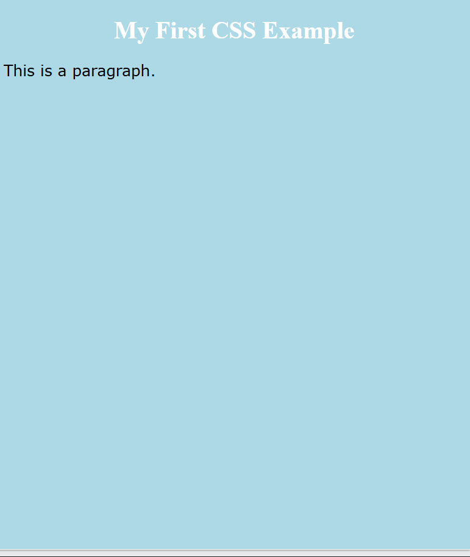

## 📘 **JUDUL MATERI: Apa Itu CSS?!**
> **CSS (Cascading Style Sheets)**  adalah bahasa yang digunakan untuk mengatur tampilan visual sebuah website. Jika HTML diibaratkan sebagai kerangka atau struktur bangunan, maka CSS adalah bagian yang menentukan warna cat, ukuran ruangan, tata letak, dan dekorasi agar bangunan terlihat menarik dan nyaman dilihat.

## 🛠 **Fungsi CSS**
> CSS memiliki peran yang cukup penting pada desain sebuah website karena berfungsi sebagai pengatur tampilan visual yang menentukan bagaimana sebuah halaman web dilihat dan dirasakan oleh pengguna. Dengan CSS, pengembang dapat mengubah halaman web yang awalnya sederhana menjadi lebih menarik, rapi, dan mudah digunakan. kalau misal gaada CSS nya sebuah webiste hanya akan terlihat teks dan elemen-elemen dasar.

**Fungsi-fungsi CSS diantaranya**
- Mengatur Warna dan Latar Belakang
  ```css 
    body {
  background-color: lightblue;
    }
  ```

- Mengatur Teks dan Font
```css
    p {
      font-family: Arial;
      font-size: 16px;
      color: Black;
    }
```
- Mengatur jarak dan ukuran elemen
```css
  div {
  margin: 20px;
  padding: 10px;
}
```

- Mengatur Tata Letak (Layout)
```css
  .container {
  display: flex;
  justify-content: center;
}
```

- Membuat Tampilan Responsif
```css
@media (max-width: 600px) {
  body {
    background-color: white;
     }
}
```
 
<h1> Contoh Penggunaan </h1>

```css
body {
  background-color: lightblue;
}
h1 {
  color: white;
  text-align: center;
}
p {
  font-family: verdana;
  font-size: 20px;
}
```

<h1> Output </h1>

<div class="tab-pane" data-tab="image">

  
</div>


## 📂 **Perbedaan HTML dan CSS** 

> HTML dan CSS memiliki fungsi yang berbeda namun saling melengkapi. HTML bertugas menyusun struktur konten, sedangkan CSS bertugas mengatur tampilannya.
>
>Secara sederhana, perbedaan HTML dan CSS dapat dijelaskan sebagai berikut:
>- HTML digunakan untuk membuat elemen seperti judul, paragraf, gambar, dan tautan
>- CSS digunakan untuk mengatur warna, ukuran teks, jarak, dan tata letak elemen tersebut
>
>Dengan kata lain, HTML adalah kerangka website, sedangkan CSS adalah desain dan dekorasinya.


## 📃**Selector CSS** 
<table> <tr> <th>Selektor</th> <th>Fungsi</th> <th>Contoh</th> </tr> <tr> <td><code>*</code></td> <td>Semua elemen</td> <td><code>* { }</code></td> </tr> <tr> <td><code>tag</code></td> <td>Elemen HTML tertentu</td> <td><code>p { }</code></td> </tr> <tr> <td><code>.class</code></td> <td>Berdasarkan class</td> <td><code>.menu { }</code></td> </tr> <tr> <td><code>#id</code></td> <td>Berdasarkan id</td> <td><code>#judul { }</code></td> </tr> <tr> <td><code>tag1, tag2</code></td> <td>Gabungan selektor</td> <td><code>h1, h2 { }</code></td> </tr> <tr> <td><code>tag.class</code></td> <td>Tag dengan class tertentu</td> <td><code>p.tebal { }</code></td> </tr> <tr> <td><code>tag tag</code></td> <td>Elemen di dalam elemen lain</td> <td><code>div p { }</code></td> </tr> </table>


