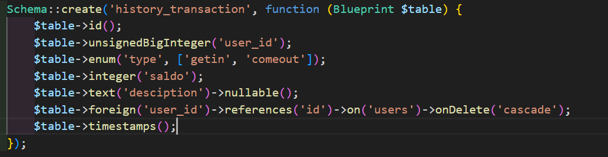
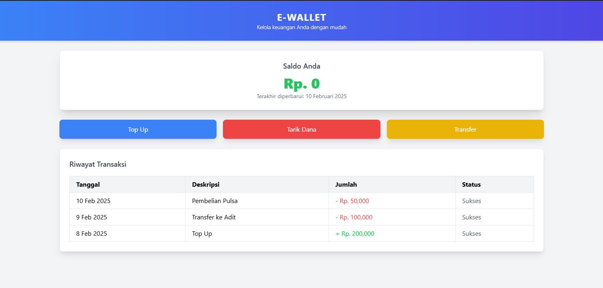

1. Heading (Judul)

# Heading 1 (Judul Utama)
## Heading 2 (Sub Judul)
### Heading 3
#### Heading 4
##### Heading 5
###### Heading 6


2. Format Teks

*Teks miring*        // Gunakan tanda * atau _
**Teks tebal**       // Gunakan tanda ** atau __
***Teks tebal miring***
~~Teks dicoret~~     // Gunakan tanda ~~


3. Link dan Gambar
[Google](https://www.google.com)     // Menampilkan link

 // Menampilkan gambar

4. List (Daftar)
a. Daftar Tidak Bernomor (Unordered List)
- Item 1
- Item 2
  - Sub item
* Item 3

b. Daftar Bernomor (Ordered List)
1. Item satu
2. Item dua
   1. Sub item

6. Tabel
truktur tabel menggunakan | dan -.
| Nama     | Umur | Kota     |
|----------|------|----------|
| Andi     | 25   | Jakarta  |
| Budi     | 30   | Bandung  |


7. Blockquote (Kutipan)
> Ini adalah kutipan
>> Ini adalah kutipan di dalam kutipan


8. Garis Horizontal
Untuk memisahkan bagian antar topik.
---

9. Karakter Escape
Gunakan \ untuk menampilkan karakter khusus Markdown sebagai teks biasa.
\*tidak dimiringkan\*

10. Checklist (To-Do List)
Cocok untuk membuat daftar tugas.
- [ ] Belum dikerjakan
- [x] Sudah selesai

11. Kode
Untuk menandai blok kode.
```php
public function contoh()
{
    echo "Halo, ini adalah contoh kode.";
}
```
12. Tautan
Untuk membuat tautan.
[Contoh Tautan](https://www.contoh.com)

13. Gambar
Untuk menambahkan gambar.


14. Teks Kode
Untuk menandai teks sebagai kode.
`echo "Halo, ini adalah teks kode.";`

15. Kode Blok
Untuk menandai blok kode.
```
echo "Halo, ini adalah kode blok.";
```


# Form Documentation

<div class="tab-container">
  <div class="tab-buttons">
    <button class="tab-button active" data-tab="code">Code View</button>
    <button class="tab-button" data-tab="image">Image View</button>
  </div>
  <div class="tab-content">
    <div class="tab-pane active" data-tab="code">

```PHP
<form action="{{ route('barangatk.printSelected') }}" method="POST" id="print-form">
	@csrf
	<div class="p-3">View
		<table class="table-responsive w-full rounded mb-2">
			<thead class="bg-gray-200">
				<tr>
					<th class="border px-4 py-2">No.</th>
					<th class="border w-1/7 px-4 py-2">Image</th>
					<th class="border w-1/4 px-4 py-2">Nama Barang</th>
					<th class="border w-1/6 px-4 py-2">Kode Barang</th>
					<th class="border w-1/5 px-4 py-2">Kategori Barang</th>
					<th class="border w-1/7 px-4 py-2">Qty.</th>
					<th class="border w-1/7 px-4 py-2">Aksi</th>
				</tr>
			</thead>
			<tbody>
				@foreach ($barang_atk as $data)
				<tr>
					<td class="border px-4 py-2">{{ $loop->iteration }}</td>                            
				<td class="border px-4 py-4">
					gambar_brg) }}" class="zoomable-image -pointer rounded shadow-lg" alt="Image of {{ $data->nama_brg }}">
				</td>
				<td class="border px-4 py-2">{{ $data->nama_brg }}</td>
				<td class="border px-4 py-2">{{ $data->kode_brg_atk }}</td>
				<td class="border px-4 py-2">{{ $data->kategori_brg_atk }}</td>
				<td class="border px-4 py-2">{{ $data->stok_brg}}</td>
					<td class="border px-4 py-2">
						<input type="checkbox" name="selected_barangatk[]" value="{{ $data->id }}" class="select-item">
						//class select-item untuk javascript
					</td>
				</tr>
				@endforeach
			</tbody>
		</table>
		<div class="flex p-2 items-center">
			<a type="button" href="{{ route('barangatk.index') }}" class="fa fa-arrow-left bg-red-600 hover:bg-blue-800 text-white font-bold py-2 px-4 rounded-full">
				Kembali
			</a>
			<div class="fa fa-print bg-blue-600 hover:bg-blue-800 text-white font-bold py-2 px-4 rounded-full mx-2">
				checkbox select all :
				<label class="switch">
					<input type="checkbox" id="select-all">
					//id = select-all untuk javascript
				</label>
			</div>
			<button type="submit" class="fa fa-print bg-blue-600 hover:bg-blue-800 text-white font-bold py-2 px-4 rounded-full">
				Print Selected
			</button>
		</div>
	</div>
</form>
```

  </div>
<div class="tab-pane" data-tab="image">

  
</div>